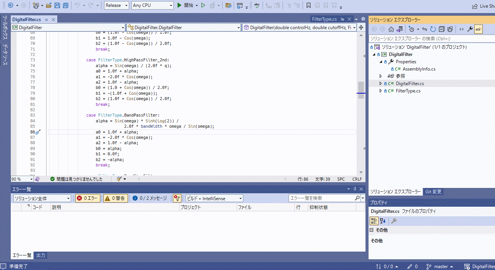
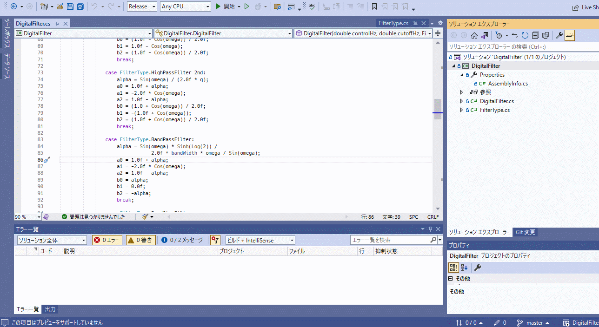

# OpenNativeContextMenu

Open native context menu with selected file or project or solution.

## Features

- Can open Windows native context menu.

## Usage

1. Select the target file or project or solution.
2. Select `OpenNativeContexMenu` from the context menu.
3. The Windows native context menu will appear.

## Example

File
  
Project

## Thanks

The following [source code](https://apathysoftworks.com/ahk/ShellContextMenu.ahk){:target="_blank"} is customized for use.

## License

Licensed under MIT
